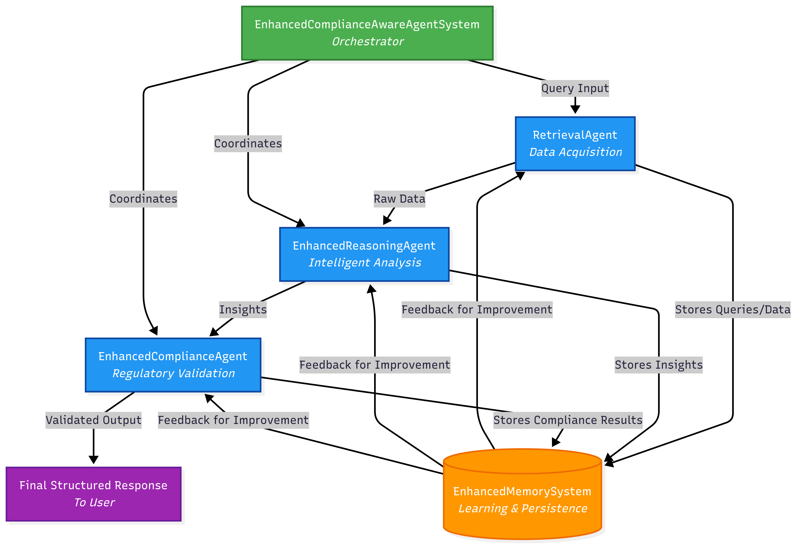

# Compliance-Aware Multi-Agent System

A sophisticated multi-agent system for compliance-aware data exploration, featuring intelligent reasoning, regulatory validation, and persistent memory for continuous learning. 

## 🌟 Overview

This system integrates specialized agents to fetch, analyze, and validate data while ensuring compliance with regulatory standards (e.g., HIPAA, GDPR). It includes:

- **Retrieval Agent**: Fetches real-time data from external APIs (e.g., weather or public datasets).
- **Reasoning Agent**: Performs multi-step reasoning with chain-of-thought analysis to generate structured insights.
- **Compliance Agent**: Validates outputs against simulated HIPAA/GDPR rules, ensuring data privacy and regulatory adherence.
- **Memory System**: Logs queries and outcomes to improve future performance.

The system is modular, scalable, and designed for enterprise-grade deployment, with comprehensive testing and analytics.

## 🏗️ System Architecture

The system follows a modular architecture with orchestrated agents:

```
EnhancedComplianceAwareAgentSystem (Orchestrator)
├── RetrievalAgent (Data Acquisition)
├── EnhancedReasoningAgent (Intelligent Analysis)
├── EnhancedComplianceAgent (Regulatory Validation)
└── EnhancedMemorySystem (Learning & Persistence)
```

## Architecture Diagram
The following diagram shows how the agents interact:



## 🚀 Getting Started

### Prerequisites

- Python 3.8+
- Git
- Virtual environment (recommended)
- API keys for external data sources (e.g., OpenWeatherMap for demo queries, configurable in `config.py`)

### Installation

1. **Clone the repository**:
   ```bash
   git clone https://github.com/HassanYousafzai/compliance-multi-agent.git
   cd compliance-multi-agent
   ```

2. **Set up a virtual environment**:
   ```bash
   python -m venv venv
   source venv/bin/activate  # On Windows: venv\Scripts\activate
   ```

3. **Install dependencies**:
   ```bash
   pip install -r requirements.txt
   ```

4. **Configure API keys** (if using external APIs):
   - Copy `config.example.py` to `config.py`.
   - Add your API keys (e.g., OpenWeatherMap) in `config.py`.

### Running the System


#### Command Line Interface

```bash
# Run example queries
python run_system.py examples

# Interactive mode
python run_system.py interactive
# Type queries like "What's the weather in London?" and "quit" to exit

# Run comprehensive demo
python run_system.py demo
```

### Demonstration Queries

The following example queries demonstrate the system's end-to-end functionality:

1. **Query**: "What's the weather in London?"
   - **Retrieval**: Fetches real-time weather data via API.
   - **Reasoning**: Synthesizes structured insights (e.g., temperature, conditions).
   - **Compliance**: Checks for sensitive data in outputs (none expected).
   - **Output**: Structured JSON with weather details.

2. **Query**: "Analyze patient data trends for compliance."
   - **Retrieval**: Simulates fetching anonymized patient data.
   - **Reasoning**: Identifies trends (e.g., average patient age).
   - **Compliance**: Validates against HIPAA rules (e.g., no PHI leakage).
   - **Output**: Structured report with compliance status.

3. **Query**: "Summarize user activity in Paris."
   - **Retrieval**: Fetches mock user activity data.
   - **Reasoning**: Generates summary (e.g., activity frequency).
   - **Compliance**: Ensures GDPR compliance (e.g., consent validation).
   - **Output**: Structured summary with compliance metadata.

Run `python run_system.py demo` to see these queries in action.

### Testing
```bash
# Run all tests
python -m pytest tests/ -v

# Run specific test suite
python tests/test_enhanced_system.py

# Run performance tests
python examples/performance_test.py
```

## 🛡️ Compliance Features

- **HIPAA Compliance**: Detects PHI and scans for medical terminology.
- **GDPR Compliance**: Identifies personal data and validates consent.
- **Data Retention**: Checks for data expiration.
- **Audit Trail**: Logs queries, outcomes, and violations for traceability.


## 📁 Project Structure

```
compliance-multi-agent/
├── src/                        # Core source code
│   ├── main.py                 # System orchestrator
│   ├── retrieval_agent.py      # Data acquisition
│   ├── enhanced_reasoning_agent.py  # Intelligent analysis
│   ├── enhanced_compliance_agent.py # Regulatory validation
│   └── memory_system.py        # Learning and persistence
├── tests/                      # Unit and integration tests
├── examples/                   # Demo scripts and performance tests
├── docs/                       # Architecture and guides
├── requirements.txt            # Python dependencies
└── run_system.py              # Main entry point
```


## 📄 License

This project is licensed under the MIT License - see the [LICENSE](LICENSE) file for details.
